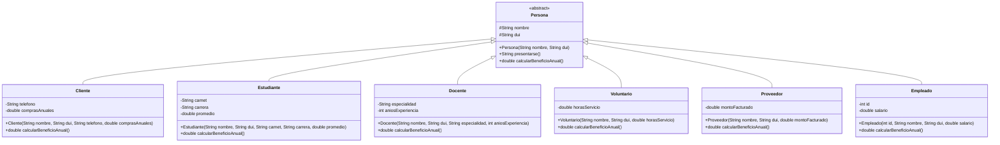

# Diagrama de clases - Semana 6

```mermaid
classDiagram

class Persona {
    <<abstract>>
    #String nombre
    #String dui
    +Persona(String nombre, String dui)
    +String presentarse()
    +double calcularBeneficioAnual()
}

class Cliente {
    -String telefono
    -double comprasAnuales
    +Cliente(String nombre, String dui, String telefono, double comprasAnuales)
    +double calcularBeneficioAnual()
}

class Estudiante {
    -String carnet
    -String carrera
    -double promedio
    +Estudiante(String nombre, String dui, String carnet, String carrera, double promedio)
    +double calcularBeneficioAnual()
}

class Docente {
    -String especialidad
    -int aniosExperiencia
    +Docente(String nombre, String dui, String especialidad, int aniosExperiencia)
    +double calcularBeneficioAnual()
}

class Voluntario {
    -double horasServicio
    +Voluntario(String nombre, String dui, double horasServicio)
    +double calcularBeneficioAnual()
}

class Proveedor {
    -double montoFacturado
    +Proveedor(String nombre, String dui, double montoFacturado)
    +double calcularBeneficioAnual()
}

class Empleado {
    -int id
    -double salario
    +Empleado(int id, String nombre, String dui, double salario)
    +double calcularBeneficioAnual()
}

Persona <|-- Cliente
Persona <|-- Estudiante
Persona <|-- Docente
Persona <|-- Voluntario
Persona <|-- Proveedor
Persona <|-- Empleado
```